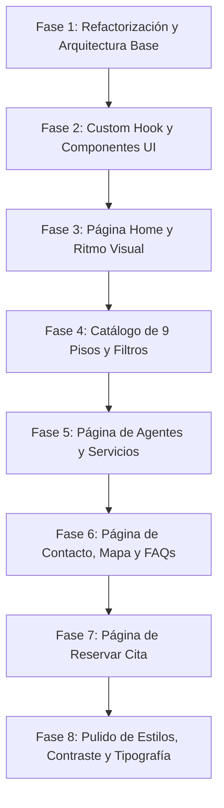

# 📚 Documentación Oficial del Proyecto: Nido Estudiantil Granada

> Guía técnica y pedagógica completa con la arquitectura, principios de diseño, estructura de archivos y orden de implementación paso a paso.

---

## 🧭 1. Visión General del Proyecto
- **Nombre:** Nido Estudiantil Granada
- **Propósito:** Plataforma web inmobiliaria moderna, reactiva y especializada en el alquiler de pisos y habitaciones para estudiantes universitarios en Granada.
- **Stack Tecnológico:**
  - **React 18** (Vite)
  - **React Router DOM v6** (Enrutamiento cliente / SPA)
  - **Vanilla CSS Modular** (BEM, variables CSS personalizadas, diseño responsive y temas de alto contraste)
  - **JavaScript Moderno (ES6+)**

---

## 🏛️ 2. Principios de Clean Code Aplicados
1. **Regla de Idiomas:**
   - **Código (100% en inglés):** Nombres de componentes, carpetas, archivos, variables, funciones, hooks y clases CSS (`PropertyListing`, `useCountUp`, `activeFilter`, `.property-card`).
   - **Contenido (en español):** Todo el texto visible para el usuario final (*"Encuentra tu piso en Granada"*, *"Reserva tu cita"*).
2. **Separación de Responsabilidades (SRP):**
   - Los **datos** residen en `src/data/` desacoplados de los componentes.
   - Las **vistas/páginas** solo ensamblan secciones modulares (`src/pages/`).
   - Los **componentes UI reutilizables** viven en `src/components/ui/` sin lógica acoplada.
   - La **lógica reactiva compleja** se abstrae en custom hooks (`src/hooks/`).
3. **Estilos sin Inline Styles:** Todo el diseño se gestiona mediante clases BEM y variables globales en `src/styles/`.
4. **Coherencia de Datos de Negocio:** Métricas unificadas en todo el sitio: *5 años de experiencia, 80+ pisos gestionados, 180+ estudiantes alojados*.

---

## 📁 3. Estructura del Proyecto (Carpeteo)

```
c:/Proyectos/miproyectoinmobiliariapatri/
├── public/                         # Assets estáticos (fotografías reales, favicons, etc.)
│   ├── agent_patricia.jpg          # Foto Directora Comercial
│   ├── agent_juan.jpg              # Foto Agente Inmobiliario
│   ├── agent_marta.jpg             # Foto Atención al Cliente
│   ├── agent_diego.jpg             # Foto Agente Inmobiliario
│   ├── agent_laura.jpg             # Foto Coordinadora de Visitas
│   ├── apartment_ronda.jpg         # Foto piso Ronda
│   ├── apartment_botanico.jpg      # Foto piso Jardín Botánico
│   ├── apartment_recogidas.jpg     # Foto piso Recogidas
│   ├── apartment_figares.jpg       # Foto piso Fígares
│   ├── apartment_montijo.jpg       # Foto piso Casería de Montijo
│   ├── apartment_gran_capitan.jpg  # Foto piso Gran Capitán
│   ├── apartment_puerta_real.jpg   # Foto piso Puerta Real
│   ├── apartment_zaidin.jpg        # Foto piso Zaidín
│   ├── apartment_realejo.jpg       # Foto piso El Realejo
│   ├── hero_apartment.jpg          # Panorámica de Granada
│   └── team_office.jpg             # Foto del equipo en oficina
│
├── src/
│   ├── components/
│   │   ├── layout/                 # Elementos fijos de navegación y pie de página
│   │   │   ├── Navbar.jsx          # Barra de navegación con logo, enlaces y botón CTA
│   │   │   └── Footer.jsx          # Pie de página con enlaces, contacto y copyright
│   │   │
│   │   ├── sections/               # Secciones modulares e independientes
│   │   │   ├── Hero.jsx            # Cabecera de Inicio
│   │   │   ├── StatsBar.jsx        # Barra de métricas animadas (Home)
│   │   │   ├── Expertise.jsx       # Sección "Por qué elegirnos" con índice (01, 02, 03)
│   │   │   ├── Team.jsx            # Vista previa del equipo en Home
│   │   │   ├── Properties.jsx      # Pisos destacados en Home
│   │   │   ├── CtaSection.jsx      # Banner final "¿Todavía no has encontrado tu piso?"
│   │   │   ├── ListingsHero.jsx    # Hero de la página de Pisos
│   │   │   ├── PropertyListing.jsx # Grid de pisos + Filtros interactivos reactivos
│   │   │   ├── AgentsHero.jsx      # Hero de la página de Agentes
│   │   │   ├── AgentsStats.jsx     # Banner claro de métricas de agentes
│   │   │   ├── AgentsGrid.jsx      # Grid de 5 tarjetas de agentes con especialidades
│   │   │   ├── AgentsServices.jsx  # Fila de 3 servicios (Una habitación, Piso completo, Asesoramiento)
│   │   │   ├── ContactHero.jsx     # Hero de Contacto
│   │   │   ├── ContactMain.jsx     # Info de sede + Formulario reactivo con validación
│   │   │   ├── ContactMap.jsx      # Mapa interactivo en Calle Recogidas 42
│   │   │   ├── ContactFaq.jsx      # Acordeón interactivo de preguntas frecuentes
│   │   │   ├── BookingHero.jsx     # Hero de Reservar Cita
│   │   │   └── BookingMain.jsx     # Formulario de visita interactivo + Pasos (01 al 04)
│   │   │
│   │   └── ui/                     # Componentes atómicos reutilizables
│   │       ├── PropertyCard.jsx    # Tarjeta de inmueble con badges y precio
│   │       ├── TeamCard.jsx        # Tarjeta de asesor con foto y rol
│   │       └── StatItem.jsx        # Contador animado reutilizable
│   │
│   ├── constants/
│   │   └── layout.js               # Constantes de dimensiones (NAVBAR_HEIGHT, etc.)
│   │
│   ├── data/                       # Fuentes de datos estructurados (Single Source of Truth)
│   │   ├── properties.js           # Catálogo de los 9 pisos con precios y características
│   │   ├── team.js                 # Datos y fotos de los 5 agentes
│   │   ├── expertise.js            # Ventajas competitivas
│   │   ├── services.js             # Los 3 servicios universitarios
│   │   ├── faq.js                  # Preguntas frecuentes con respuestas
│   │   └── bookingSteps.js         # Pasos del proceso de reserva de cita
│   │
│   ├── hooks/
│   │   └── useCountUp.js           # Custom hook para animación de números al hacer scroll
│   │
│   ├── pages/                      # Páginas completas (ensambladoras de secciones)
│   │   ├── Home.jsx                # Página principal (/)
│   │   ├── Pisos.jsx               # Catálogo de pisos (/pisos)
│   │   ├── Agents.jsx              # Equipo de agentes (/agentes)
│   │   ├── Contact.jsx             # Formulario y mapa (/contacto)
│   │   └── Booking.jsx             # Reserva de visitas (/reservar)
│   │
│   ├── styles/                     # Arquitectura de estilos CSS
│   │   ├── variables.css           # Tokens de diseño (colores, fuentes, radios, sombras)
│   │   ├── base.css                # Reset, tipografía y utilidades globales
│   │   ├── layout.css              # Estilos de Navbar y Footer
│   │   └── sections.css            # Estilos de todas las secciones y páginas
│   │
│   ├── App.jsx                     # Enrutador principal (BrowserRouter + Routes)
│   ├── index.css                   # Punto de entrada de estilos globales
│   └── main.jsx                    # Punto de entrada de React en el DOM
```

---

## 🗺️ 4. Mapa de Rutas de la Aplicación

| Ruta | Componente Página | Propósito |
|---|---|---|
| `/` | `Home.jsx` | Presentación de marca, ventajas, agentes y pisos destacados con alto contraste. |
| `/pisos` | `Pisos.jsx` | Catálogo completo de 9 pisos con filtros reactivos por barrio y contador en vivo. |
| `/agentes` | `Agents.jsx` | Presentación del equipo de 5 asesores con especialidades por campus y servicios. |
| `/contacto` | `Contact.jsx` | Información de la sede, formulario de contacto, mapa interactivo y FAQs en acordeón. |
| `/reservar` | `Booking.jsx` | Formulario de reserva de visitas conectado al catálogo de pisos y guía de pasos. |

---

## 🛠️ 5. Proceso y Orden de Construcción (Paso a Paso)



### Detalle de las Fases:
1. **Fase 1 — Fundamentos y Limpieza:**
   - Migración de carpetas (`components/`, `data/`, `hooks/`, `pages/`, `styles/`).
   - Traducción de todo el código a nomenclatura en inglés.
   - Eliminación de archivos obsoletos y creación de `src/constants/layout.js`.
2. **Fase 2 — Lógica Reactiva Reutilizable:**
   - Creación del hook `useCountUp.js` usando `IntersectionObserver` y `requestAnimationFrame` para animar contadores sólo cuando son visibles en pantalla.
   - Construcción de `StatItem.jsx`, `PropertyCard.jsx` y `TeamCard.jsx`.
3. **Fase 3 — Home & Contraste:**
   - Implementación del ritmo visual alternado (*Oscuro → Gris Claro `#ededed` → Blanco `#ffffff` → Gris Suave `#ededed` → Oscuro*).
   - Reemplazo de emojis por índices tipográficos arquitectónicos (`01`, `02`, `03`) con insignias en verde neón (`#b7ff00`).
4. **Fase 4 — Catálogo de Pisos:**
   - Ampliación a 9 inmuebles con fotografías reales en `data/properties.js`.
   - Lógica con `useState` para filtrado reactivo automático según el barrio.
5. **Fase 5 — Página de Agentes:**
   - Creación de `AgentsHero`, `AgentsStats`, `AgentsGrid` y `AgentsServices`.
   - Asignación de 5 fotos reales únicas y coherencia en las métricas del negocio.
6. **Fase 6 — Página de Contacto:**
   - Formulario reactivo con control de estado y mensaje de confirmación.
   - Mapa interactivo en Calle Recogidas (OpenStreetMap optimizado).
   - Acordeón interactivo para preguntas frecuentes (`ContactFaq.jsx`).
7. **Fase 7 — Página de Reservas:**
   - Formulario de selección de piso conectado dinámicamente al catálogo, validación de fechas (mínimo hoy) y franjas horarias.
   - Explicación de los 4 pasos del proceso de visita.

---

## 🎨 6. Paleta de Colores y Tokens de Diseño

| Token | Valor CSS | Uso |
|---|---|---|
| `--color-primary` | `#b7ff00` | Verde lima neón de acento, badges activos y botones principales |
| `--color-accent-dark` | `#4d7c0f` / `#65a30d` | Verde de alto contraste para textos y títulos sobre fondo claro |
| `--color-bg` | `#111111` | Fondo oscuro para Heroes, CTA y Footer |
| `--color-surface-light` | `#ffffff` | Fondo blanco puro para secciones de equipo y formularios |
| `--color-surface-grey` | `#ededed` | Fondo gris suave para romper la monotonía y dar contraste |
| `--color-border` | `rgba(255, 255, 255, 0.1)` / `#e2e8f0` | Bordes limpios en modo oscuro y claro |

---

## 🚀 8. Despliegue en Vercel y Solución al Error 404 en Rutas SPA

### ❓ El Problema:
En aplicaciones **SPA (Single Page Applications)** creadas con React + Vite y `react-router-dom`:
- Cuando el usuario navega haciendo clic, React gestiona las rutas en el navegador.
- Pero al **recargar la página (F5)** o **entrar directamente a una URL** (como `/pisos`, `/agentes`, `/contacto` o `/reservar`), el servidor de Vercel busca un archivo físico llamado `pisos.html` en el servidor, no lo encuentra y devuelve un error **404: NOT_FOUND**.

---

### 💡 La Solución (Rewrites en `vercel.json`):
Para resolverlo en este y en cualquier futuro proyecto:
1. Crea un archivo llamado `vercel.json` en la **raíz del proyecto** (al mismo nivel que `package.json`).
2. Pega exactamente esta configuración:

```json
{
  "rewrites": [
    {
      "source": "/(.*)",
      "destination": "/index.html"
    }
  ]
}
```

### 🧠 ¿Qué hace este archivo?
Le indica al servidor de Vercel que **cualquier petición a cualquier ruta (`/(.*)`)** sea redirigida internamente a `index.html`. Una vez cargado `index.html`, **React Router** toma el control en el navegador del cliente y renderiza la página correcta sin dar error 404.

---

## ⚡ 9. Comandos para Ejecutar el Proyecto

```bash
# Instalar dependencias (si se descarga en un entorno nuevo)
npm install

# Iniciar el servidor de desarrollo local
npm run dev

# Compilar para producción
npm run build
```

